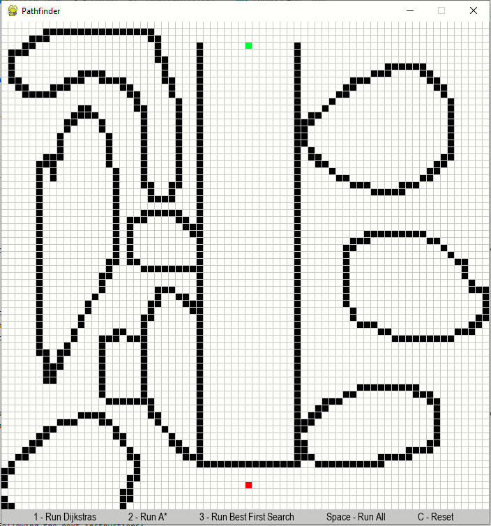
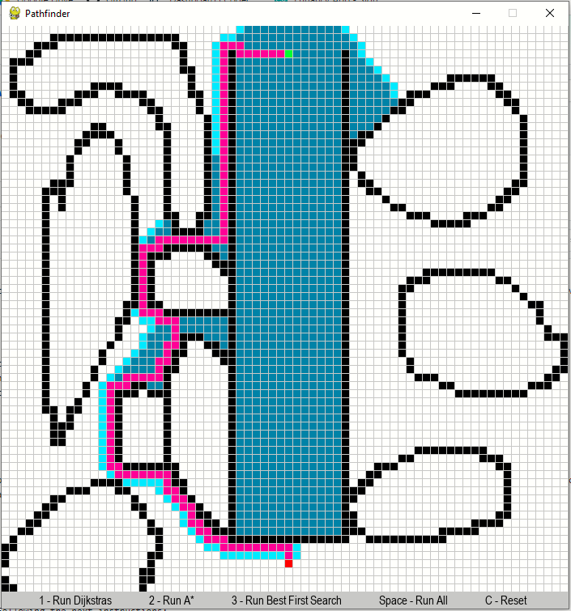

# Pathfinder
This is a visulaization tool that compares Dijkstras search, A* search, and Best First Search pathfinding algorithms. 

It allows the user to place the start node (green), end node (red), and barriers (black) anywhere on the grid. When the algorithm is activated it attempts to find the shortest path between the start and end node. A picture showing the shortest path is shown below.  

If you would like to see a visual of the search algoritms running there is a video in the video folder of this repository showing the algorithms searching through different mazes! 

# What I Learnt
<ol>
 <li>Used Pygame to build visualiztion GUI.</li>
 <li>Built graph by creating a custom Node class.</li>
 <li>Implemented the following path finding algorithms:
  <ul>
    <li><b>Dijkstra's</b> (Breadth First Search)</li>
    <li><b>A*</b> (Guided search using manhattan heuristic)</li>
    <li><b>Best First search</b> (Greedy search using manhattan heuristic)</li> 
  </ul>
 </li>
 <li>Implemented full authorization/authentication functionality using flask_login.</li>
</ol>

# User Instructions
1- Save all contents of the folder "GUI Sudoku Solver" on your computer in the same folder. 
2- Run "Sudoku Solver GUI.py". The GUI window will display as shown below. 

3- Try beating the puzzle! To make an entry enter a number into a field and click "Enter Value" if the entry is correct the board will update and the input field for the cell you updated will disapear, if the entry is wrong nothing will happen.
4- If you get stuck click "Solve Game" and the program will solve the rest of the puzzle for you.

 
